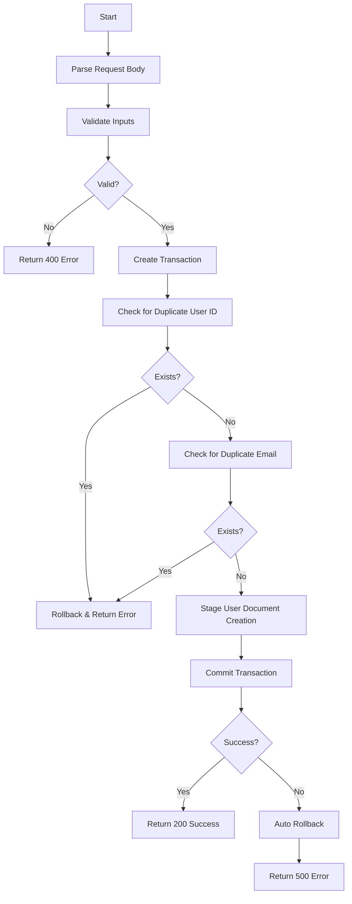

# Atomic User Signup Function

## Overview
This Appwrite Function implements **atomic user signup** using Appwrite's native database transactions. It ensures that user data is created in an all-or-nothing manner, preventing partial user creation and maintaining data consistency.

## Benefits

### 🔒 **ACID Compliance**
- **Atomicity**: Either all operations succeed or all fail
- **Consistency**: Database remains in a valid state
- **Isolation**: Concurrent signups don't interfere with each other
- **Durability**: Once committed, data is permanently saved

### ⚡ **Performance & Reliability**
- **Automatic Rollback**: No manual cleanup needed on failure
- **Conflict Detection**: Prevents duplicate users automatically
- **Single Network Call**: Faster than multiple DB operations from client
- **Server-Side Validation**: Better security and data integrity

### 🛡️ **Data Integrity**
- Prevents partial user records (e.g., user created but QR reference missing)
- Guarantees email uniqueness within transaction scope
- Validates all inputs before committing
- Automatic cleanup on any failure

---

## Function Details

### **Function Name**: `atomicSignup`
### **Runtime**: Node.js 18+
### **Dependencies**: `node-appwrite@^20.2.1`

---

## Request Format

### **Method**: POST
### **Content-Type**: application/json

### **Request Body**:
```json
{
  "userId": "string",        // Required - User ID from Appwrite Auth
  "email": "string",         // Required - User's email address
  "name": "string",          // Required - User's full name
  "qrImageId": "string",     // Required - QR code file ID (already uploaded)
  "profilePicId": "string",  // Required - Profile picture file ID (already uploaded)
  "phone": "string",         // Required - Phone number with country code (e.g., +919123456789)
  "countryCode": "string"    // Optional - Default: +91
}
```

### **Field Validation**:
- `userId`: Must be valid Auth user ID
- `email`: Must be valid email format, checked for duplicates
- `name`: Non-empty string
- `qrImageId`: Valid file ID from storage
- `profilePicId`: Valid file ID from storage
- `phone`: At least 10 digits

---

## Response Format

### **Success Response** (200):
```json
{
  "success": true,
  "data": {
    "userId": "68fa3c67000a8c294dd1",
    "email": "user@example.com",
    "name": "John Doe",
    "profilePicUrl": "https://cloud.appwrite.io/v1/storage/buckets/.../files/.../view?project=...",
    "qrImageId": "68fa3c67000a8c294dd1_user_qr.png",
    "phoneNumber": "+919123456789",
    "message": "User signup completed successfully with Appwrite Transactions"
  }
}
```

### **Error Response** (400/500):
```json
{
  "success": false,
  "error": "Error message",
  "code": "ERROR_CODE",
  "details": "Detailed error information",
  "transactionRolledBack": true
}
```

### **Error Codes**:
- `VALIDATION_ERROR`: Missing or invalid required fields
- `INVALID_EMAIL`: Email format validation failed
- `INVALID_PHONE`: Phone number validation failed
- `DUPLICATE_USER`: User ID already exists in database
- `DUPLICATE_EMAIL`: Email already registered
- `CONFLICT_ERROR`: Database conflict detected
- `SIGNUP_ERROR`: General signup error
- `NOT_FOUND_ERROR`: Database or collection not found
- `PERMISSION_ERROR`: Permission denied

---

## Transaction Flow



---

## Android Integration

### **1. Add BuildConfig Constant**
In `app/build.gradle.kts`, add:
```kotlin
buildConfigField("String", "ATOMIC_SIGNUP_FUNCTION_ID", "\"atomicSignup\"")
```

### **2. Repository Method**
```kotlin
suspend fun addUserToDBAtomic(
    userId: String,
    email: String,
    name: String,
    qrImageId: String,
    profilePicId: String,
    phone: String
): Boolean {
    val functions = io.appwrite.services.Functions(client)
    val execution = functions.createExecution(
        functionId = BuildConfig.ATOMIC_SIGNUP_FUNCTION_ID,
        body = JSONObject().apply {
            put("userId", userId)
            put("email", email)
            put("name", name)
            put("qrImageId", qrImageId)
            put("profilePicId", profilePicId)
            put("phone", phone)
        }.toString(),
        async = false
    )
    
    val response = JSONObject(execution.responseBody)
    return response.getBoolean("success")
}
```

### **3. ViewModel Method**
```kotlin
suspend fun addUserToDBAtomicSync(...): Boolean {
    return appwriteRepository.addUserToDBAtomic(...)
}
```

### **4. Fragment Usage**
```kotlin
val success = appwriteViewModel.addUserToDBAtomicSync(
    userId = user.id,
    email = user.email,
    name = user.name,
    qrImageId = qrCodeId,
    profilePicId = profilePicId,
    phone = phone
)
```

---

## Environment Variables Required

Set these in your Appwrite Function configuration:

```env
DATABASE_ID=your_database_id
USER_PROFILE_PIC_BUCKET_ID=your_profile_pic_bucket_id
APPWRITE_FUNCTION_PROJECT_ID=your_project_id
APPWRITE_API_KEY=your_api_key
```

---

## Deployment

### **Deploy to Appwrite**:
```bash
cd Functions_Appwrite
appwrite deploy function
# Select: atomicSignup
```

### **Configure Function**:
1. Set timeout to at least 15 seconds
2. Add environment variables
3. Set execution permissions
4. Enable function in production

---

## Testing

### **Test with cURL**:
```bash
curl -X POST \
  https://cloud.appwrite.io/v1/functions/atomicSignup/executions \
  -H 'Content-Type: application/json' \
  -H 'X-Appwrite-Project: YOUR_PROJECT_ID' \
  -H 'X-Appwrite-Key: YOUR_API_KEY' \
  -d '{
    "userId": "test123",
    "email": "test@example.com",
    "name": "Test User",
    "qrImageId": "qr_file_id",
    "profilePicId": "profile_file_id",
    "phone": "+919123456789"
  }'
```

### **Expected Success**:
- Status: 200
- Response contains `"success": true`
- User document created in database
- Transaction committed

### **Test Duplicate Email**:
Run same request twice - second should fail with `DUPLICATE_EMAIL` error.

---

## Error Handling

### **Automatic Rollback**:
If ANY operation fails:
1. Transaction automatically rolls back
2. No partial user data persists
3. Database remains consistent
4. Client receives error with details

### **Common Issues**:

| Issue | Cause | Solution |
|-------|-------|----------|
| `VALIDATION_ERROR` | Missing required fields | Check all fields are provided |
| `DUPLICATE_EMAIL` | Email already registered | Use different email or login |
| `PERMISSION_ERROR` | Insufficient permissions | Check API key and collection permissions |
| `CONFLICT_ERROR` | Concurrent signup | Retry the operation |
| Timeout | Function taking too long | Check network and database performance |

---

## Performance Considerations

- **Transaction TTL**: 180 seconds (3 minutes)
- **Average Execution Time**: 300-800ms
- **Maximum Concurrent Users**: Handled by Appwrite's conflict detection
- **Retry Strategy**: Implement exponential backoff for transient errors

---

## Comparison: Old vs New Approach

### **Old Approach** (Direct DB Operations):
```kotlin
❌ createDocument(user) -> Success
❌ If QR upload fails -> User exists without QR (inconsistent!)
❌ If profile pic fails -> User exists without profile pic (inconsistent!)
❌ Manual rollback needed
❌ Race conditions possible
```

### **New Approach** (Atomic Transaction):
```kotlin
✅ Begin Transaction
✅ Stage: createDocument(user)
✅ Commit: All or nothing
✅ Automatic rollback on failure
✅ No race conditions
✅ Guaranteed consistency
```

---

## Security

- ✅ Server-side validation
- ✅ Duplicate detection within transaction
- ✅ Email format validation
- ✅ Phone number validation
- ✅ Automatic permission checks
- ✅ No client-side manipulation possible

---

## Monitoring & Logs

### **Key Log Messages**:
- `Starting atomic user signup with Appwrite Transactions`
- `Transaction created successfully`
- `User ID verified as unique`
- `User document creation staged`
- `Transaction committed successfully`
- `User signup completed successfully`

### **Error Logs**:
- `User document already exists` → Duplicate user
- `Email already registered` → Duplicate email
- `Booking failed, rolling back transaction` → Transaction failure

---

## Future Enhancements

- [ ] Add profile completion percentage
- [ ] Send welcome email after signup
- [ ] Add user preferences in same transaction
- [ ] Support multiple phone numbers
- [ ] Add email verification status

---

## Support

For issues or questions:
1. Check function logs in Appwrite Console
2. Verify environment variables
3. Test with cURL to isolate client/server issues
4. Check database permissions
5. Review transaction timeout settings

---

**Last Updated**: 2025-10-23  
**Version**: 1.0.0  
**Author**: ShowGo Team

